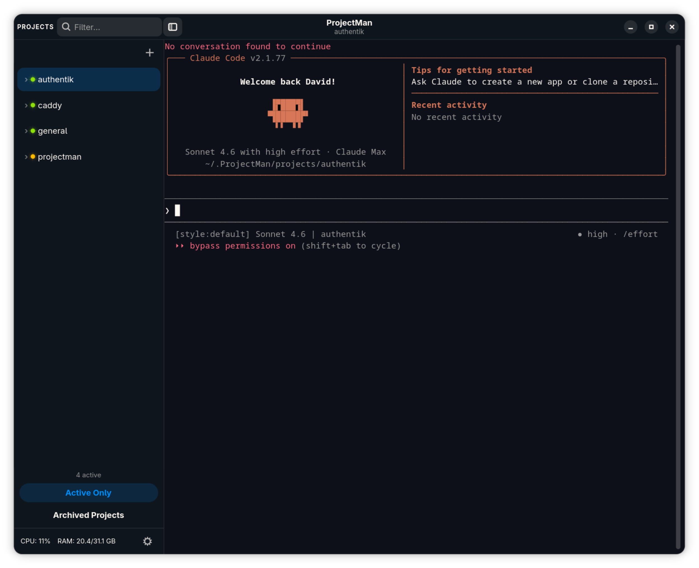
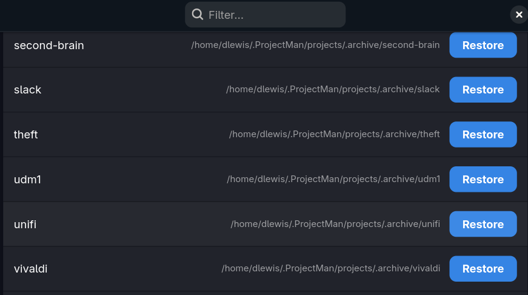
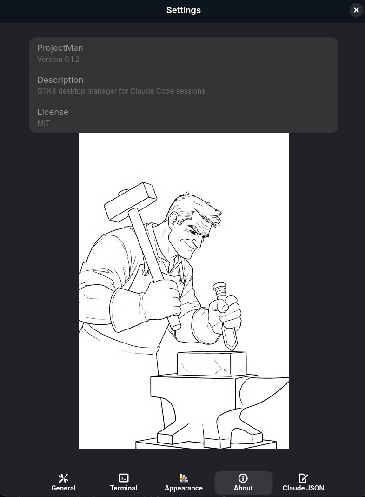

# ProjectMan


A GTK4/Adwaita desktop application for managing [Claude Code](https://claude.ai/code) sessions.

ProjectMan displays a project sidebar on the left and an embedded VTE terminal on the right,
running `claude` (or `zellij attach`) per project. Projects are directories under
`~/.ProjectMan/projects/` (configurable via Settings).



## Features

- Per-project Claude Code sessions with automatic session restore
- Live status indicators: working / waiting / done / idle
- Session history with expand/collapse per project
- Zellij multiplexer integration (optional)
- Project archive with search

  

- Ctrl+Tab to switch between recently active projects
- Multiple color themes: Argonaut, Candyland, Phosphor, Salt Spray
- Sidebar pin/collapse with persistent width
- Terminal right-click menu (Copy, Paste, Select All, Open URL / Copy URL)
- Ctrl+click to open URLs and file paths
- Process-tree CPU / RAM resource bar
- ntfy push notifications on session completion

### Projects Admin Agent (PAA)

The sparkle (✦) button in the sidebar opens the PAA — a background health monitor that
continuously scans your projects and surfaces actionable findings in a card-based window.

**Filesystem checks (always on):**
- Missing `CLAUDE.md`
- No git repository
- Context drift — stale file references in `CLAUDE.md` (bare filenames, relative paths,
  and absolute paths all resolved; external references deduplicated automatically)

**AI checks (optional, requires Haiku API access):**
- Semantic staleness — `CLAUDE.md` no longer describes what the project actually does
- Outdated or conflicting dependency versions
- General project health

**Cross-project analysis:**
- Stale projects (configurable inactivity threshold)
- Broken `../sibling/` references between projects
- Shared dependency version conflicts

**Card window:**
- Filter by project, criticality, or finding type
- **Discuss** button — opens an interactive Claude session with the finding pre-loaded as
  context, plus any other pending findings for the same project so related issues can be
  addressed together
- Dismiss / Acknowledge actions with persistent ledger (survives restarts)
- Sparkle button throbs only when new findings appear

**PAA settings (Settings → PAA):**
- Enable/disable toggle and scan interval
- Haiku toggle, monthly token budget, and model selection for scans and chat

## Requirements

**System packages** (install before running `install.sh`):

| Distro | Command |
|--------|---------|
| Fedora / RHEL | `sudo dnf install python3-gobject gtk4 libadwaita vte291-gtk4` |
| Ubuntu / Debian | `sudo apt install python3-gi gir1.2-gtk-4.0 gir1.2-adw-1 gir1.2-vte-3.91` |
| Arch | `sudo pacman -S python-gobject gtk4 libadwaita vte3` |

**Other requirements:**
- Python 3.10+
- [`claude` CLI](https://claude.ai/code) installed and on your PATH
- Node.js (for the hook script that powers live status indicators)

**Optional:** `zellij` for multiplexed terminal sessions.

## Installation

```bash
git clone https://github.com/dlewis7444/projectman.git
cd projectman
./install.sh
```

This installs ProjectMan to `~/.local/share/projectman/`, creates a `projectman` launcher
in `~/.local/bin/`, and registers it with your desktop environment (GNOME, KDE, etc.) so it
appears in your app launcher.

> **Note:** `~/.local/bin` must be on your `PATH`. If the `projectman` command isn't found
> after install, add this to your shell profile (`~/.bashrc`, `~/.zshrc`, etc.):
> ```bash
> export PATH="$HOME/.local/bin:$PATH"
> ```

### Migrating existing Claude projects

If you already have Claude Code project directories, move or symlink them into
`~/.ProjectMan/projects/` so ProjectMan can find them:

```bash
mkdir -p ~/.ProjectMan/projects

# Move a project
mv ~/my-project ~/.ProjectMan/projects/

# Or symlink it (leaves the original in place)
ln -s ~/my-project ~/.ProjectMan/projects/my-project
```

You can also point ProjectMan at a different directory entirely via **Settings → Projects Directory**.

### Enabling status indicators

The coloured status dots (working / waiting / done) require a hook script to be registered
with Claude Code. The script is installed to `~/.claude/projectman/hook.js` automatically —
you just need to tell Claude Code to run it.

Add the following to `~/.claude/settings.json` (create the file if it doesn't exist):

```json
{
  "hooks": {
    "PreToolUse":        [{"hooks": [{"type": "command", "command": "node ~/.claude/projectman/hook.js"}]}],
    "PostToolUse":       [{"hooks": [{"type": "command", "command": "node ~/.claude/projectman/hook.js"}]}],
    "PostToolUseFailure":[{"hooks": [{"type": "command", "command": "node ~/.claude/projectman/hook.js"}]}],
    "UserPromptSubmit":  [{"hooks": [{"type": "command", "command": "node ~/.claude/projectman/hook.js"}]}],
    "PermissionRequest": [{"hooks": [{"type": "command", "command": "node ~/.claude/projectman/hook.js"}]}],
    "Notification":      [{"hooks": [{"type": "command", "command": "node ~/.claude/projectman/hook.js"}]}],
    "Stop":              [{"hooks": [{"type": "command", "command": "node ~/.claude/projectman/hook.js"}]}],
    "SessionStart":      [{"hooks": [{"type": "command", "command": "node ~/.claude/projectman/hook.js"}]}],
    "SessionEnd":        [{"hooks": [{"type": "command", "command": "node ~/.claude/projectman/hook.js"}]}]
  }
}
```

You can also edit this file from within ProjectMan via **Settings → Claude JSON**.

Status dots work without this step — they just won't update in real time until hooks are configured.

## Updating

```bash
cd projectman
git pull
./install.sh
```

## Uninstalling

```bash
./install.sh --uninstall
```

This removes the installed files, launcher, and desktop entry. Your data directory
(`~/.ProjectMan/`) and hook script (`~/.claude/projectman/hook.js`) are left in place.

## Running from Source

No install required for development:

```bash
python main.py
```

```bash
python -m pytest
```

## Configuration



| Path | Purpose |
|------|---------|
| `~/.ProjectMan/settings.json` | App settings |
| `~/.ProjectMan/session.json` | Session restore data |
| `~/.ProjectMan/projects/` | Default projects directory |
| `~/.ProjectMan/paa-ledger.json` | PAA findings ledger |
| `~/.claude/projectman/hook.js` | Claude Code hook script for status updates |
| `~/.claude/settings.json` | Claude Code settings (hook registration) |

## License

MIT — see [LICENSE](LICENSE).
