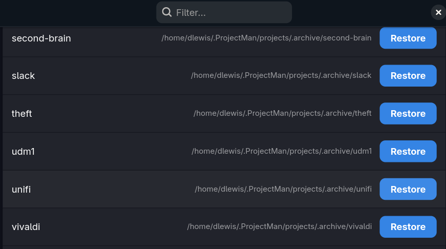

# ProjectMan


A GTK4/Adwaita desktop cockpit for AI coding harnesses.

Sidebar of projects on the left, embedded VTE terminal on the right. Each project
runs the harness you choose — [Claude Code](https://claude.ai/code),
[OpenCode](https://opencode.ai), [Grok Build](https://x.ai/cli), or
[Kimi Code](https://moonshotai.github.io/kimi-code/en/) — with session
restore, live status dots, and optional Zellij multiplexing. Projects live under
`~/.ProjectMan/projects/` by default (configurable in Settings).

## Table of contents

- [How to run](#how-to-run)
- [Features](#features)
- [Requirements](#requirements)
- [Installation lifecycle](#installation-lifecycle)
- [Harnesses](#harnesses)
  - [Claude Code](#claude-code)
  - [OpenCode](#opencode)
  - [Grok Build](#grok-build)
  - [Kimi Code](#kimi-code)
- [First-run setup](#first-run-setup)
- [Projects Admin Agent (PAA)](#projects-admin-agent-paa)
- [Configuration](#configuration)
- [Troubleshooting](#troubleshooting)
- [See also](#see-also)
- [License](#license)

## How to run

Two tracks — pick one.

### Installed (recommended)

```bash
git clone https://github.com/dlewis7444/projectman.git
cd projectman
./install.sh
```

Then ensure `~/.local/bin` is on your `PATH` and launch from your app menu, or run:

```bash
projectman
```

If `projectman` is not found:

```bash
export PATH="$HOME/.local/bin:$PATH"
```

### From source (development)

From a checkout, with system packages installed (see [Requirements](#requirements)):

```bash
python main.py
```

```bash
python -m pytest
```

**First success checklist** (either track):

1. System packages + D-Bus session bus (Requirements)
2. At least one harness binary on `PATH` ([Harnesses](#harnesses))
3. Projects under `~/.ProjectMan/projects/` (or change the directory in Settings)
4. Optional but recommended: [First-run setup](#first-run-setup) so status dots update live

## Features

- Per-project harness sessions with automatic session restore
- Pluggable harnesses — Claude Code, OpenCode, Grok Build, and Kimi Code side by side
- Live status indicators: working / waiting / done / idle
- Session history with expand/collapse per project
- Optional [Zellij](https://zellij.dev) multiplexer integration
- Project archive with search
- Ctrl+Tab between recently active projects
- Color themes: Argonaut, Candyland, Phosphor, Salt Spray
- Sidebar pin/collapse with persistent width
- Terminal right-click menu (Copy, Paste, Select All, Open URL / Copy URL)
- Ctrl+click to open URLs and file paths
- Process-tree CPU / RAM resource bar
- [ntfy](https://ntfy.sh) push notifications on session completion
- **Projects Admin Agent (PAA)** — background health monitor for your project tree
  ([details](#projects-admin-agent-paa))



## Requirements

**System packages** (install before running `install.sh` or `python main.py`):

| Distro | Command |
|--------|---------|
| Fedora / RHEL | `sudo dnf install python3-gobject gtk4 libadwaita vte291-gtk4` |
| Ubuntu / Debian | `sudo apt install python3-gi gir1.2-gtk-4.0 gir1.2-adw-1 gir1.2-vte-3.91` |
| Arch | `sudo pacman -S python-gobject gtk4 libadwaita vte3` |

A D-Bus **session bus** is required at runtime. Full desktop sessions already
have one. On minimal or headless installs, install `dbus-x11` (provides
`dbus-launch`) or ensure `$XDG_RUNTIME_DIR/bus` exists — without a session bus,
ProjectMan crashes on first launch.

**Also required:**

| Component | Notes |
|-----------|--------|
| Python 3.10+ | Application runtime |
| Node.js | Claude Code status-indicator hook only |
| At least one harness binary | `claude`, `opencode`, `grok`, and/or `kimi` on `PATH` |

**Optional:** `zellij` for multiplexed terminal sessions.

### Coding harnesses (install at least one)

ProjectMan is a cockpit — it does not bundle a coding agent. Install whichever
you use; each is optional and they work side by side. A harness appears in the
sidebar **Harness** submenu only when its binary is on your `PATH`.

| Harness | Binary | Install |
|---------|--------|---------|
| **Claude Code** | `claude` | `curl -fsSL https://claude.ai/install.sh \| bash` |
| **OpenCode** | `opencode` | `curl -fsSL https://opencode.ai/install \| bash` |
| **Grok Build** | `grok` | `curl -fsSL https://x.ai/cli/install.sh \| bash` |
| **Kimi Code** | `kimi` | `curl -fsSL https://code.kimi.com/kimi-code/install.sh \| bash` |

Deep spawn/continue/resume behavior and model flags live under
[Harnesses](#harnesses). Bridge/hook registration is under
[First-run setup](#first-run-setup).

## Installation lifecycle

### Install

```bash
git clone https://github.com/dlewis7444/projectman.git
cd projectman
./install.sh
```

This installs ProjectMan to `~/.local/share/projectman/`, creates a `projectman`
launcher in `~/.local/bin/`, and registers a desktop entry so it appears in your
app launcher (GNOME, KDE, etc.). The installer also places harness status bridges
where it can (Claude hook script, OpenCode plugin, Grok hooks, Kimi hooks) — see
[First-run setup](#first-run-setup) for any manual registration still required.

### Migrate existing projects

If you already keep Claude Code (or other) project directories elsewhere, move or
symlink them into the projects tree:

```bash
mkdir -p ~/.ProjectMan/projects

# Move a project
mv ~/my-project ~/.ProjectMan/projects/

# Or symlink (leaves the original in place)
ln -s ~/my-project ~/.ProjectMan/projects/my-project
```

You can also point ProjectMan at a different directory via
**Settings → Projects Directory**.

### Update

```bash
cd projectman
git pull
./install.sh
```

### Uninstall

```bash
./install.sh --uninstall
```

Removes the installed files, launcher, and desktop entry. Your data directory
(`~/.ProjectMan/`) and harness-side hooks/bridges are left in place.

### Run from source

No install required for day-to-day development:

```bash
python main.py
python -m pytest
```

## Harnesses

Pick a harness per project from the sidebar right-click **Harness** menu, or set
a default under **Settings → Harnesses**.

**Activation vs New Session:** clicking a project (or accepting **Restart Now**
after a harness/provider change) continues the most recent conversation in the
effective harness (`-c` / continue, with per-harness fallback to a fresh session
when nothing can be continued). **New Session** in the sidebar always starts
fresh.

### Spawn / continue / resume

| Harness | Spawn | Continue | Resume |
|---------|-------|----------|--------|
| **Claude Code** | `claude` | `claude -c` (falls back to fresh `claude` if nothing to continue) | `claude --resume <session_id>` |
| **OpenCode** | `opencode` | `opencode -c` | `opencode -s <id>` |
| **Grok Build** | `grok` | `grok -c` (falls back to fresh `grok` if nothing to continue) | `grok -r <id>` |
| **Kimi Code** | `kimi` | `kimi -c` (kimi itself starts fresh when nothing to continue; PM does **not** wrap with `\|\| kimi`) | `kimi -S <id>` |

### Claude Code

- **Per-project model** follows ProjectMan’s Models / provider settings (including
  optional router setups).
- **Status dots** need the Claude hook registered once — see
  [First-run setup](#first-run-setup).
- Session history and restore use Claude’s own continue/resume flags as in the
  table above.

### OpenCode

- Session history is listed with `opencode session list`, run **from the project
  directory** (cwd-scoped). Older OpenCode builds that kept per-session JSON on
  disk have a storage-scan fallback; current builds use SQLite (`opencode.db`),
  which that fallback does not read — on those versions the CLI is the session
  source.
- **Per-project model** is passed as `-m <provider>/<model>` (e.g.
  `ollama/qwen3.5:cloud`). OpenCode is multi-provider natively; no
  claude-code-router is involved.
- **Status dots** need the OpenCode bridge plugin — installed by `install.sh` or
  **Settings → Harnesses → Install bridge**. Details:
  [`bridges/opencode/README.md`](bridges/opencode/README.md).

For local Ollama / OpenAI-compatible endpoints and headless `opencode run`
quirks, see [Troubleshooting](#troubleshooting).

### Grok Build

- Session history uses `grok sessions list` from the project directory
  (cwd-scoped). Session ids are UUIDv7. If `grok -c` has nothing to continue, it
  exits cleanly and ProjectMan falls back to a fresh `grok`.
- **Per-project model** is passed as `-m <value>`, where `<value>` is a **config
  key** from `~/.grok/config.toml` (not a `provider/model` string). Grok reaches
  custom endpoints through its own config.
- **Status dots** need the Grok bridge (`~/.grok/hooks/`) — installed by
  `install.sh` or **Settings → Harnesses → Install bridge**. Details:
  [`bridges/grok/README.md`](bridges/grok/README.md).
- **Waiting (blue) dot is inferred.** Grok does not fire a hook while a
  permission prompt is on screen, so ProjectMan promotes to `waiting` when a tool
  start goes unanswered for 5 seconds. A long-running *approved* tool can briefly
  show a false `waiting` until the tool completes — a false “needs you” beats a
  silently stalled session.

By default grok signs in with a SuperGrok / xAI account (browser OAuth on first
run). To use a local Ollama / OpenAI-compatible endpoint without an xAI account,
see [Grok + local endpoints](#grok--local-endpoints).

`install.sh` also sets `[compat.claude] hooks = false` in `~/.grok/config.toml`
(idempotently) so Claude’s ProjectMan hook does not double-fire on grok events.
If you manage that file by hand, keep that setting.

Grok auto-updates by default; ProjectMan does not suppress it. To pin a version:

```toml
# ~/.grok/config.toml
[cli]
auto_update = false
```

### Kimi Code

- **Install** lands the binary at `~/.kimi-code/bin/kimi` (ensure that dir is on
  `PATH`, or rely on remote-spawn PATH prepending which includes it).
- There is **no** `kimi sessions list` CLI. ProjectMan lists sessions by scanning
  `~/.kimi-code/session_index.jsonl` + each session’s `state.json`, filtered by
  exact `workDir` match to the project path (newest 7).
- **Continue:** `kimi -c`. When nothing is continuable, kimi itself starts a
  fresh session in-process and exits 0 — so ProjectMan’s continue wrapper does
  **not** fall back with `|| kimi` (unlike Claude/OpenCode/Grok).
- **Resume:** `kimi -S <sessionId>` (official `--session`; prefer `-S` over the
  hidden `-r` alias).
- **Per-project model** is passed as `-m <alias>` — a model key from
  `~/.kimi-code/config.toml` (e.g. `kimi-code/kimi-for-coding`). Kimi reaches
  providers via its own config; no env/ccr injection.
- **Status dots** need the Kimi bridge: status script under
  `~/.kimi-code/hooks/` plus `[[hooks]]` entries merged into
  `~/.kimi-code/config.toml`. Installed by `install.sh` or **Settings →
  Harnesses → Install bridge**. Details:
  [`bridges/kimi/README.md`](bridges/kimi/README.md).
- **Waiting** maps directly from Kimi’s `PermissionRequest` hook (fires just
  before the approval prompt) — no silence-age inference needed.

Auth: `kimi login` (device-code OAuth). Presence of
`~/.kimi-code/credentials/kimi-code.json` or `~/.kimi-code/oauth/kimi-code` is
shown on the Harnesses page (contents never read).

#### Grok + local endpoints

To run grok against a local Ollama / OpenAI-compatible API with **no xAI
account**, add a model entry that **includes `api_key`**:

```toml
[model.local-qwen]
model = "qwen3.5:9b"
base_url = "http://<host>:11434/v1"
name = "Qwen3.5 9B (local)"
context_window = 32768
api_key = "ollama"
```

The `api_key` value can be any non-empty string (Ollama ignores it) — but it
**must be present**. Without a per-model `api_key`, grok starts browser OAuth
even for a custom endpoint. With it, turns complete offline of xAI and no
`~/.grok/auth.json` is created. Set the per-project model in ProjectMan to the
config **key** (`local-qwen` in the example).

## First-run setup

Status dots (working / waiting / done) need a small bridge on each harness so it
can write ProjectMan’s status files under `~/.ProjectMan/status/`. Dots still
appear without this; they just won’t update in real time.

### Claude Code hooks

`install.sh` installs the hook script to `~/.claude/projectman/hook.js`. Register
it in `~/.claude/settings.json` (create the file if needed):

```json
{
  "hooks": {
    "PreToolUse":        [{"hooks": [{"type": "command", "command": "node ~/.claude/projectman/hook.js"}]}],
    "PostToolUse":       [{"hooks": [{"type": "command", "command": "node ~/.claude/projectman/hook.js"}]}],
    "PostToolUseFailure":[{"hooks": [{"type": "command", "command": "node ~/.claude/projectman/hook.js"}]}],
    "UserPromptSubmit":  [{"hooks": [{"type": "command", "command": "node ~/.claude/projectman/hook.js"}]}],
    "PermissionRequest": [{"hooks": [{"type": "command", "command": "node ~/.claude/projectman/hook.js"}]}],
    "Notification":      [{"hooks": [{"type": "command", "command": "node ~/.claude/projectman/hook.js"}]}],
    "Stop":              [{"hooks": [{"type": "command", "command": "node ~/.claude/projectman/hook.js"}]}],
    "SessionStart":      [{"hooks": [{"type": "command", "command": "node ~/.claude/projectman/hook.js"}]}],
    "SessionEnd":        [{"hooks": [{"type": "command", "command": "node ~/.claude/projectman/hook.js"}]}]
  }
}
```

Edit that file in your editor if you need to merge with existing hooks; ProjectMan
does not ship an in-app JSON editor for it.

### OpenCode bridge

`install.sh` drops the plugin into `~/.config/opencode/plugins/projectman.js`
(idempotent), or use **Settings → Harnesses → Install bridge**. See
[`bridges/opencode/README.md`](bridges/opencode/README.md).

### Grok Build bridge

`install.sh` installs a JSON hook definition plus an executable Python status
script under `~/.grok/hooks/` (paths rewritten to absolute at install time), or
use **Settings → Harnesses → Install bridge**. See
[`bridges/grok/README.md`](bridges/grok/README.md).

### Kimi Code bridge

`install.sh` installs the status script under `~/.kimi-code/hooks/` and merges
idempotent `[[hooks]]` entries into `~/.kimi-code/config.toml` (Kimi has no
separate hooks JSON), or use **Settings → Harnesses → Install bridge**. See
[`bridges/kimi/README.md`](bridges/kimi/README.md).

## Projects Admin Agent (PAA)

The sparkle (✦) button in the sidebar opens the PAA — a background health monitor
that scans your projects and surfaces findings in a card-based window.

### Filesystem checks

Always on while PAA is enabled:

- Missing `CLAUDE.md`
- No git repository
- Context drift — stale file references in `CLAUDE.md` (bare filenames, relative
  paths, and absolute paths resolved; external references deduplicated)

### AI checks

Optional — **Settings → PAA → Enable AI Scans**.

AI scans run Claude Code (`claude -p`) with your **Models-page provider** and
scan tier (Haiku / Sonnet / Opus tiers mapped to that provider’s models). Native
Anthropic is used when no custom provider is selected. Filesystem checks stay
free either way; turn AI scans off if you do not want model calls.

- Semantic staleness — `CLAUDE.md` no longer matches what the project does
- Outdated or conflicting dependency versions
- General project health

Sidebar context menu **AI Scan** forces an on-demand AI scan of one project.

### Cross-project analysis

- Stale projects (configurable inactivity threshold)
- Broken `../sibling/` references between projects
- Shared dependency version conflicts

### Card UI

- Filter by project, criticality, or finding type
- **Discuss** — opens an interactive PAA agent session with the finding (and other
  pending findings for the same project) as context
- Dismiss / Acknowledge with a persistent ledger (survives restarts)
- Sparkle button throbs only when new findings appear

### Settings

**Settings → PAA:** enable/disable, scan interval, Enable AI Scans, monthly token
budget, and scan/chat tier.

## Configuration

| Path | Purpose |
|------|---------|
| `~/.ProjectMan/settings.json` | App settings |
| `~/.ProjectMan/session.json` | Session restore data |
| `~/.ProjectMan/status/` | Per-project harness status files |
| `~/.ProjectMan/projects/` | Default projects directory |
| `~/.ProjectMan/paa-ledger.json` | PAA findings ledger |
| `~/.claude/projectman/hook.js` | Claude Code status hook script |
| `~/.claude/settings.json` | Claude Code settings (hook registration) |
| `~/.config/opencode/plugins/projectman.js` | OpenCode status bridge |
| `~/.grok/hooks/projectman.json` + `projectman-status.py` | Grok Build status bridge |
| `~/.grok/config.toml` | Grok config (compat hooks, models, auto-update) |

## Troubleshooting

### App crashes immediately / D-Bus errors

**Symptom:** ProjectMan exits on launch with D-Bus errors, or never opens a window
on a minimal/headless box.

**Fix:** Provide a D-Bus session bus. On a full desktop this is normal; on minimal
setups install `dbus-x11` or ensure `$XDG_RUNTIME_DIR/bus` exists.

### Harness missing from the Harness menu

**Symptom:** Claude Code, OpenCode, or Grok Build does not appear under the
sidebar **Harness** submenu.

**Fix:** Its binary is not on `PATH` (`claude`, `opencode`, or `grok`). Install
the harness and open a new shell (or restart ProjectMan) so the updated `PATH`
is visible.

### Status dots stuck or not updating

**Symptom:** Sidebar dots stay idle or never move through working / waiting / done
while a session is active.

**Fix:** Complete [First-run setup](#first-run-setup) for that harness. Confirm
the hook or plugin is installed and that the harness process is the one
ProjectMan spawned for that project directory.

### OpenCode: empty output from headless `opencode run` against Ollama

**Symptom:** `opencode run -m ollama/...` prints empty output (exit 0) even when
the endpoint returned a valid answer.

**Fix:** This is OpenCode-version-dependent, not a ProjectMan bug. ProjectMan
spawns the **interactive TUI** (`opencode` / `opencode -c`), not the headless
`run` path.

If you hit it in your own scripting: try `--thinking`, try another OpenCode
version, and use a straightforward provider config. Example shape for
`~/.config/opencode/opencode.json`:

```jsonc
{
  "model": "ollama/qwen3.5:cloud",
  "provider": {
    "ollama": {
      "name": "Ollama",
      "npm": "@ai-sdk/openai-compatible",
      "options": { "baseURL": "http://<host>:11434/v1" },
      "models": { "qwen3.5:cloud": { "name": "qwen3.5:cloud" } }
    }
  }
}
```

### Text selection / copy broken in remote (SSH) harness sessions

Longer guide — apply only if you drive harnesses over SSH inside ProjectMan.

**Symptom:** On a **remote** host (SSH), selecting text in Claude Code, OpenCode,
or Grok Build looks like an app selection (often a blue overlay); copy fails or a
toast mentions **OSC 52**; **Shift+drag** still works.

**Why:** Modern harness TUIs enable **mouse reporting**. They capture click/drag
for in-app selection and send copy via **OSC 52**. Over SSH, ProjectMan’s VTE
does not fully implement OSC 52 clipboard write, so app-level copy fails.
Shift+drag bypasses mouse reporting and uses native terminal selection (which
Ctrl+Shift+C and right-click **Copy** can read).

ProjectMan does not rewrite harness settings for you. Apply the fix **on the
remote host** (where the harness process runs), then restart the session.

**Immediate workaround (any harness):** hold **Shift** while dragging, then copy
with **Ctrl+Shift+C** or the terminal right-click **Copy** menu.

**Claude Code** — disable mouse tracking on the remote host:

```json
// ~/.claude/settings.json  (on the remote host)
{
  "env": {
    "CLAUDE_CODE_DISABLE_MOUSE": "1"
  }
}
```

Merge into an existing `"env"` block if present. Related:
`CLAUDE_CODE_DISABLE_MOUSE_CLICKS` (keeps wheel scroll, disables click/drag only).

**OpenCode** — disable mouse capture on the remote host:

```json
// ~/.config/opencode/tui.json  (on the remote host)
{
  "$schema": "https://opencode.ai/tui.json",
  "mouse": false
}
```

Or set `OPENCODE_DISABLE_MOUSE=1`. See the
[OpenCode TUI docs](https://opencode.ai/docs/tui/).

**Grok Build** — no single “always off” mouse flag. Options:

1. Per session: `/toggle-mouse-reporting` (or the mouse-reporting keybind, often
   **Ctrl+R** when scrollback is focused). You may need:

   ```toml
   # ~/.grok/config.toml  (on the remote host)
   [ui]
   mouse_reporting_toggle = true
   ```

2. Always **Shift+drag** for native selection, then Ctrl+Shift+C / right-click Copy.

## See also

| Document | Purpose |
|----------|---------|
| [LICENSE](LICENSE) | MIT license text |
| [CHANGELOG.md](CHANGELOG.md) | Release history |
| [ROADMAP.md](ROADMAP.md) | Planned work |
| [bridges/opencode/README.md](bridges/opencode/README.md) | OpenCode status bridge details |
| [bridges/grok/README.md](bridges/grok/README.md) | Grok Build status bridge details |

## License

MIT — see [LICENSE](LICENSE).
